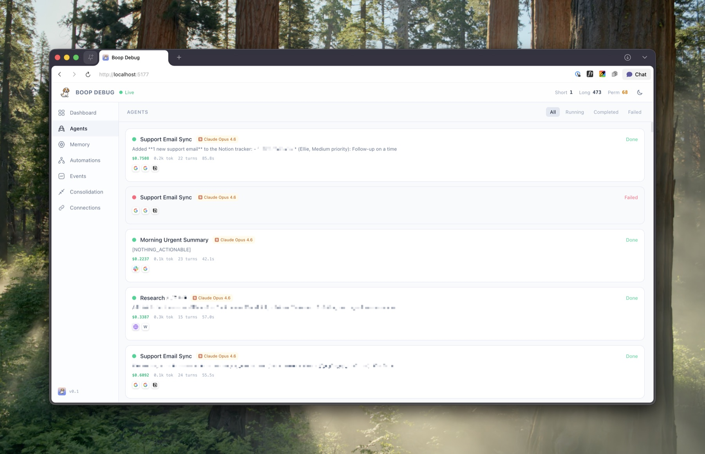
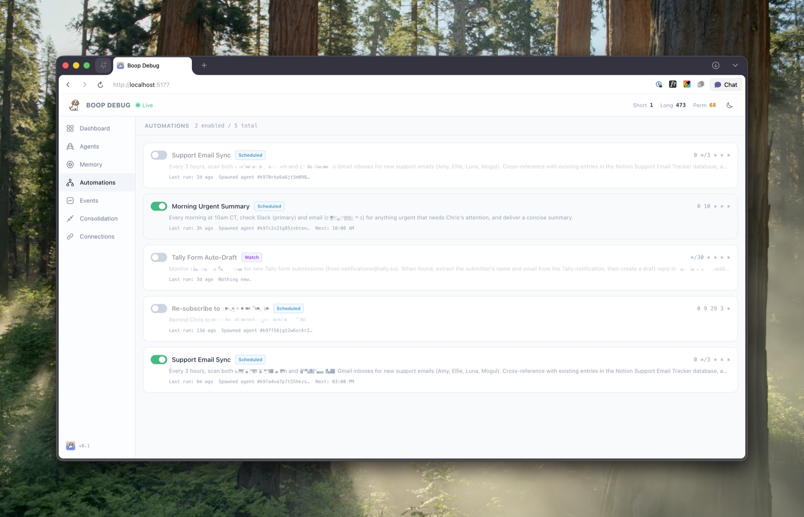
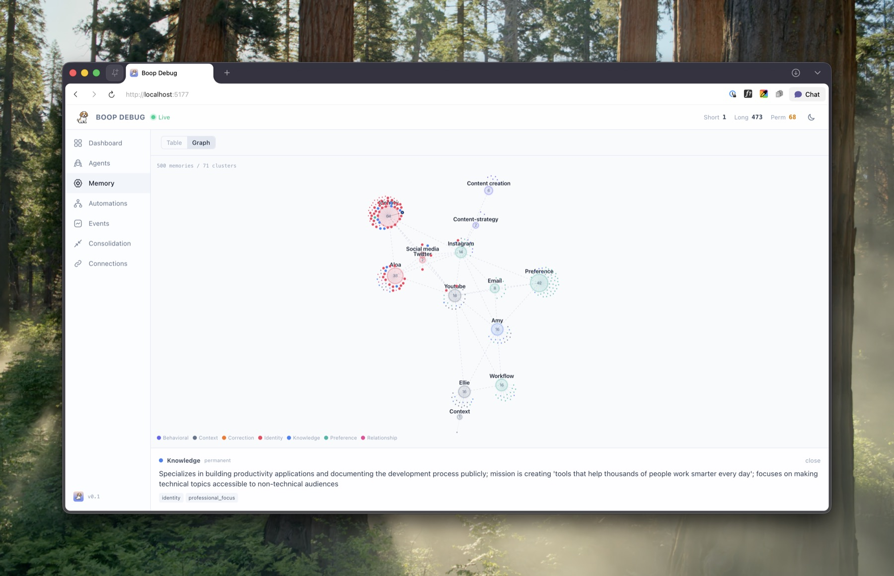
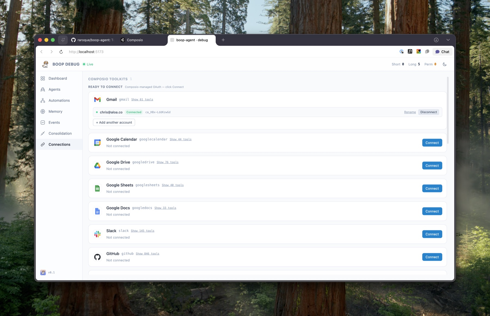

<p align="center">
  
</p>

# boop-railway-template

A WhatsApp-first personal AI agent template built on the [Claude Agent SDK](https://docs.claude.com/en/api/agent-sdk/overview), designed for one-click deploy to [Railway](https://railway.app).

```
 WhatsApp  →  Baileys socket  →  Interaction agent  →  Sub-agents (per task)
                                       │                    │
                                       ▼                    ▼
                                 Memory store  ←──  Integrations (your MCP tools)
```

Forked from [boop-agent](https://github.com/raroque/boop-agent) by Chris Raroque — same architecture, swapped messaging layer, repackaged for Railway deploys.

Built on:
- [Claude Agent SDK](https://github.com/anthropics/claude-agent-sdk-typescript) — the loop, tool use, sub-agents, MCP
- [Baileys](https://github.com/WhiskeySockets/Baileys) — WhatsApp Web protocol library
- [Composio](https://composio.dev) — 1000+ third-party integrations with hosted OAuth
- [Convex](https://convex.dev) — real-time database for memory, agents, drafts
- A Claude Code subscription **or** an Anthropic API key

---

## What you get

- **WhatsApp in / WhatsApp out** via Baileys (typing indicators, message dedup, allowlist gating).
- **Dispatcher + workers** pattern: a lean interaction agent decides what to do, spawns focused sub-agents that actually do the work.
- **Pure dispatcher** — the interaction agent has only memory + spawn + automation + draft tools. Web access, files, and integrations are explicitly denied to it; sub-agents get `WebSearch` / `WebFetch` / the integrations.
- **Tiered memory** (short / long / permanent) with post-turn extraction, decay, and cleaning.
- **Vector search** for recall when you add an embeddings key (Voyage or OpenAI) — falls back to substring.
- **Memory consolidation** — a daily 3-phase adversarial pipeline (proposer → adversary → judge) that merges duplicates, resolves contradictions, and prunes noise.
- **Automations** — the agent can schedule recurring work from a text ("every morning at 8 summarize my calendar") and push results back over WhatsApp.
- **Draft-and-send** — any external action stages a draft first; the agent only commits when the user confirms.
- **Heartbeat + retry** — stuck agents auto-fail, debug dashboard can retry.
- **Composio-powered integrations** — one API key unlocks 1000+ toolkits. Connect Gmail, Slack, GitHub, Linear, Notion, Drive, Stripe, and more from the debug dashboard.
- **Debug dashboard** (React + Vite) — Dashboard (spend + tokens + agent status), Agents (timeline + integration logos), Automations, Memory (table + force-directed graph), Events, Connections.
- **Convex** for persistence — real-time, typed, free tier.
- **Uses your Claude Code subscription** — no separate Anthropic API key required (locally; Railway needs an API key or SSH-mounted creds).

<p align="center">
  
</p>

<p align="center">
  
</p>

<p align="center">
  
</p>

<p align="center">
  
</p>

---

## Roadmap

- [x] WhatsApp channel via Baileys
- [x] `/data/.env` loader for persistent volume configs
- [x] Browser-based setup wizard (`/setup`, password-gated)
- [x] Dockerfile (Node 20 + Claude CLI baked in)
- [x] Railway template config + one-click Deploy button
- [ ] Live log viewer in the wizard (currently use `railway logs` / SSH)
- [ ] Pluggable model providers (Gemini / Groq via translation proxy)

---

## Prerequisites

| Service | Why | Free? |
|---|---|---|
| [Claude Code](https://claude.com/code) | Powers the agent. Install it, sign in once, the SDK uses your session. | Subscription required |
| [Convex](https://convex.dev) | Database + realtime. | Free tier is plenty |
| [Composio](https://composio.dev) | Optional — integrations layer. One API key unlocks ~1000 toolkits. | Free tier covers personal use |
| WhatsApp account | Channel. Use a number you control. | Free |

You do **not** need iMessage, Sendblue, ngrok, an iPhone, or a Mac.

---

## Quickstart (local)

```bash
# 1. Clone + install
git clone https://github.com/ShageeshanT/boop-railway-template.git
cd boop-railway-template
npm install

# 2. Install Claude Code (one-time, global) and sign in
npm install -g @anthropic-ai/claude-code
claude  # sign in, then Ctrl-C

# 3. Set up Convex (creates .env.local with CONVEX_URL)
npx convex dev --once --configure new
```

Add to `.env.local`:

```
WHATSAPP_ENABLED=true
WHATSAPP_ALLOWED_JIDS=<your-number-no-plus-no-spaces>
CONVEX_URL=<same-value-as-VITE_CONVEX_URL>
BOOP_UPSTREAM_CHECK=false
```

`WHATSAPP_ALLOWED_JIDS` is comma-separated, country code first, no `+` (e.g. `15551234567` for US, `447911123456` for UK). Anyone *not* in the allowlist is silently ignored.

Then in two terminals:

```bash
# Terminal 1
npm run dev:convex

# Terminal 2
npm run dev:server
```

Terminal 2 prints a QR code. On your phone: WhatsApp → Settings → **Linked Devices** → **Link a device** → scan.

Once connected, message the linked WhatsApp account from a **different** number. The agent replies. Optional: `npm run dev:debug` opens the dashboard at http://localhost:5173.

---

## Deploy to Railway

[](https://railway.com/new/github/ShageeshanT/boop-railway-template)

The template ships with a Dockerfile + `railway.json` for one-click deploys. It runs in a single service with a persistent volume for credentials.

### One-time deploy steps

1. **Click the Deploy button** above (or paste the repo URL into Railway → New Project → Deploy from GitHub).
2. **Set required env vars** in the Railway service Variables tab:
   - `SETUP_PASSWORD` — pick anything strong; gates the `/setup` wizard.
   - `CONVEX_URL` — your Convex deployment URL (run `npx convex dev` locally first to get one). Same value goes for `VITE_CONVEX_URL`.
3. **Add a volume**: Railway → service → Settings → Volumes → **+ New Volume**, mount path **`/data`**, size 1GB. The server reads/writes:
   - `/data/.env` — wizard-written runtime config
   - `/data/.claude/` — Claude CLI credentials (after step 5)
   - `/data/.wa-auth/` — WhatsApp Baileys session
4. **Deploy.** First build takes ~3–5 min. Once healthy, you'll have a public URL like `https://your-app.up.railway.app`.
5. **Log in to Claude (one-time SSH step):**
   ```bash
   railway ssh
   claude
   # follow the device-flow URL in your local browser, paste the code back
   exit
   ```
   Credentials now live on the `/data` volume — they survive redeploys.
6. **Open `https://your-app.up.railway.app/setup`** in your browser. Enter `SETUP_PASSWORD`. Fill in the form (WhatsApp allowlist, Composio key if you want integrations, etc.). Click **Save & restart**.
7. **Pair WhatsApp:** SSH back in and `railway logs` will show a QR code. On your phone: WhatsApp → Settings → Linked Devices → Link a device → scan.

### Day-to-day

- **Change config:** open `/setup`, edit, click Save & restart.
- **Update Claude credentials:** `railway ssh`, run `claude` again.
- **Re-pair WhatsApp:** SSH in, `rm -rf /data/.wa-auth`, watch `railway logs` for a fresh QR.
- **View what's happening:** `railway logs` streams everything (`[turn ...]`, `[whatsapp]`, `[agent ...]`).

### What the wizard manages

| Section | Keys |
|---|---|
| WhatsApp | `WHATSAPP_ENABLED`, `WHATSAPP_ALLOWED_JIDS` |
| Convex | `CONVEX_URL`, `VITE_CONVEX_URL` |
| Anthropic | `ANTHROPIC_API_KEY` (optional — alternative to SSH login), `BOOP_MODEL` |
| Composio | `COMPOSIO_API_KEY`, `COMPOSIO_USER_ID` |
| Embeddings | `VOYAGE_API_KEY`, `OPENAI_API_KEY` (either, optional) |

`SETUP_PASSWORD` itself is set in Railway's dashboard, not the wizard, since it gates the wizard.

---

## Architecture in 30 seconds

```
┌─────────────┐    Baileys     ┌─────────────────────┐
│  WhatsApp   │ ─────────────► │  whatsapp.ts        │
└─────────────┘                └──────────┬──────────┘
                                          │
                                          ▼
                          ┌────────────────────────────┐
                          │    Interaction agent       │
                          │    (dispatcher only)       │
                          │  • recall / write_memory   │
                          │  • spawn_agent(...)        │
                          └────────┬────────┬──────────┘
                                   │        │
                   ┌───────────────┘        └──────────────┐
                   ▼                                       ▼
           ┌───────────────┐                      ┌──────────────┐
           │   Memory      │                      │  Execution   │
           │ (Convex)      │                      │  agent(s)    │
           │ + cleaning    │                      │  + integrations│
           └───────────────┘                      └──────────────┘
```

- **Interaction agent** (`server/interaction-agent.ts`) is the front door. It reads the user's message + recent history, optionally calls `recall`, writes memories, creates automations, and decides whether to answer directly or spawn a sub-agent.
- **Execution agent** (`server/execution-agent.ts`) is spawned per task. It loads only the integrations named in the spawn call and returns a tight answer.
- **Memory** (`server/memory/`) handles writes, recall, post-turn extraction, and daily cleaning. Stored in Convex.
- **Automations** (`server/automations.ts`) poll every 30s for due jobs, spawn an execution agent to run them, and push results back to the user.
- **Integrations** are provided by [Composio](https://composio.dev). The dispatcher names toolkits by slug (`spawn_agent(integrations: ["gmail"])`); `server/composio.ts` opens a toolkit-scoped session per spawn and wraps its tools as an MCP server.

Deep dive: [ARCHITECTURE.md](./ARCHITECTURE.md). Adding your own tools: [INTEGRATIONS.md](./INTEGRATIONS.md).

---

## Skills

Skills are reusable playbooks — `SKILL.md` files under `.claude/skills/` that teach the execution agent how to do a specific kind of task. The Agent SDK loads each skill's `description` into the system prompt at boot; only the description loads upfront, so adding more is cheap.

Wiring is in `server/execution-agent.ts`:
- `settingSources: ["project"]` — tells the SDK to load `.claude/skills/`
- `"Skill"` in `allowedTools` — enables the Skill tool

Only the **execution agent** loads skills. The dispatcher stays in SDK isolation mode.

To add a skill, drop a `.claude/skills/<kebab-name>/SKILL.md`:

```yaml
---
name: youtube-script-writer
description: Write a tight, retention-focused YouTube script from a topic or outline. Use when the user asks for a video script, wants to turn research into a video, or needs a hook rewritten.
---

<instructions the agent follows when this skill is invoked>
```

Example included: `.claude/skills/youtube-script-writer/`.

---

## Using your Claude Code subscription

The Claude Agent SDK reuses the credentials Claude Code writes when you sign in. You do not need an `ANTHROPIC_API_KEY` locally.

- Install once: `npm install -g @anthropic-ai/claude-code`
- Run `claude` in a terminal, sign in.
- That's it.

If you'd rather use an API key (e.g. for a deployed server without an interactive terminal), set `ANTHROPIC_API_KEY` in `.env.local` and the SDK will use it instead.

---

## Environment variables

Everything lives in `.env.local` (local) or `/data/.env` (Railway volume). Loader checks both — see `server/env-setup.ts`.

| Var | Required | Notes |
|---|---|---|
| `CONVEX_URL` / `VITE_CONVEX_URL` | yes | Convex deployment URL. Written by `npx convex dev`. |
| `WHATSAPP_ENABLED` | yes | Set to `true` to start the Baileys socket. |
| `WHATSAPP_ALLOWED_JIDS` | strongly recommended | Comma-separated JIDs (e.g. `15551234567,15559876543`). Without this, anyone messaging the linked account can use the agent. |
| `WA_AUTH_DIR` | no | Override the WhatsApp credentials directory. Default: `<repo>/.wa-auth/`. Point this at a persistent volume in production. |
| `BOOP_DATA_DIR` | no | Where the env loader looks for `.env`. Default: `/data`. |
| `BOOP_ENV_FILE` | no | Explicit env file path; highest priority. |
| `BOOP_MODEL` | no | Default `claude-sonnet-4-6`. Runtime override via the `set_model` self-tool ("use opus" / "switch to haiku") takes precedence. |
| `BOOP_UPSTREAM_CHECK` | no | Set `false` to disable the upstream-check banner on `npm run dev`. |
| `PORT` | no | Default `3456`. |
| `VOYAGE_API_KEY` **or** `OPENAI_API_KEY` | optional | Unlocks vector recall. Falls back to substring. |
| `COMPOSIO_API_KEY` | optional | Enables integrations. Without it, plain chat + memory + automations still work. |
| `COMPOSIO_USER_ID` | optional | Stable user id Composio keys connections under. Defaults to `boop-default`. |
| `ANTHROPIC_API_KEY` | optional | Bypass the Claude Code subscription. |

---

## Integrations, via Composio

[Composio](https://composio.dev) provides the third-party integrations layer. One API key unlocks ~1000 toolkits (Gmail, Slack, GitHub, Linear, Notion, Drive, Stripe, Supabase, HubSpot, etc.). Composio hosts the OAuth apps, manages token refresh, and exposes every toolkit as a set of Claude-ready tools. The agent never sees an access token.

### Quickstart

1. Grab an API key at [app.composio.dev/developers](https://app.composio.dev/developers).
2. Add it to `.env.local`:
   ```
   COMPOSIO_API_KEY=sk-comp-...
   ```
3. Restart the server.
4. Open the debug dashboard → **Connections** tab. Click **Connect** on whichever toolkits you want — Composio handles OAuth.

After a successful connect, the agent can use that toolkit immediately — no restart.

### How it wires in

```
interaction-agent:  spawn_agent(task, integrations: ["gmail", "slack"])
                              │
                              ▼
execution-agent:    for each slug, open a Composio session scoped to that toolkit
                              │
                              ▼
                    createSdkMcpServer({ name: "gmail", tools })
                              │
                              ▼
                    Sub-agent sees mcp__gmail__GMAIL_*  — nothing else.
```

Per-spawn tool scope means tens of tools per spawn, not thousands. Context stays tight, agent stays fast. Multi-account per toolkit is supported (work + personal Gmail each get their own connection row).

Adding toolkits beyond the curated list: edit `CURATED_TOOLKITS` in `server/composio.ts`. Deeper dive: [INTEGRATIONS.md](./INTEGRATIONS.md).

### Cost tracking

Every execution agent's `total_cost_usd` comes from the Claude Agent SDK's `result` message. Every LLM call (dispatcher, execution agent, memory extraction, consolidation) writes a row to the `usageRecords` table with per-layer tokens and cost. `usageRecords:summary` gives totals by source.

---

## Project layout

```
boop-railway-template/
├── server/
│   ├── index.ts                   # Express + WS + HTTP routes
│   ├── whatsapp.ts                # Baileys socket, inbound handler, outbound send
│   ├── sendblue.ts                # iMessage adapter (dormant; no-ops without creds)
│   ├── interaction-agent.ts       # Dispatcher
│   ├── execution-agent.ts         # Sub-agent runner
│   ├── automations.ts             # Cron loop
│   ├── automation-tools.ts        # create/list/toggle/delete MCP
│   ├── draft-tools.ts             # save_draft / send_draft / reject_draft MCP
│   ├── heartbeat.ts               # Stale-agent sweep
│   ├── consolidation.ts           # 3-phase adversarial pipeline (proposer → adversary → judge)
│   ├── usage.ts                   # aggregateUsageFromResult helper
│   ├── env-setup.ts               # Loads .env from /data, .env.local, etc.
│   ├── embeddings.ts              # Voyage / OpenAI wrapper
│   ├── composio.ts                # Composio SDK wrapper
│   ├── composio-routes.ts         # /composio/* HTTP routes for the debug UI
│   ├── broadcast.ts               # WS fanout
│   ├── convex-client.ts           # Convex HTTP client
│   ├── memory/
│   │   ├── types.ts
│   │   ├── tools.ts               # write_memory / recall (vector + substring)
│   │   ├── extract.ts             # Post-turn extraction
│   │   └── clean.ts               # Decay + archive + prune
│   └── integrations/
│       ├── registry.ts            # Integration loader
│       └── composio-loader.ts     # Registers each connected Composio toolkit
├── convex/
│   ├── schema.ts
│   ├── messages.ts
│   ├── memoryRecords.ts
│   ├── agents.ts
│   ├── automations.ts
│   ├── consolidation.ts
│   ├── conversations.ts
│   ├── drafts.ts
│   ├── memoryEvents.ts
│   ├── usageRecords.ts            # Append-only per-call cost log
│   └── sendblueDedup.ts           # Message-id dedup (used by both channels)
├── debug/                         # Dashboard: Dashboard / Agents / Automations / Memory / Events / Connections
├── scripts/
│   ├── setup.ts                   # Interactive setup CLI
│   ├── dev.mjs                    # One-command orchestrator (server + convex + vite + ngrok)
│   └── preflight.mjs              # Checks convex/_generated exists before booting
├── README.md           ← you are here
├── ARCHITECTURE.md
└── INTEGRATIONS.md
```

---

## Troubleshooting

**Agent doesn't reply.**
- Check the server is running: `curl http://localhost:3456/health`
- Watch server logs. Look for `[whatsapp]` and `[turn xxx]` messages.
- If the inbound JID isn't in `WHATSAPP_ALLOWED_JIDS`, it's silently dropped — check the allowlist.

**Convex errors / `VITE_CONVEX_URL is not set`.**
- Run `npx convex dev` manually. Ensure `.env.local` has both `CONVEX_URL` and `VITE_CONVEX_URL`.

**"Could not find public function for X:Y".**
- `CONVEX_DEPLOYMENT` and `CONVEX_URL` are pointing at different projects. Make sure the URL matches the deployment name.

**Agent replies but can't use my integration.**
- Check `COMPOSIO_API_KEY` is set.
- Check the toolkit shows as **Connected** in the Connections tab.
- Watch logs for `[composio] registered …` at boot and `[integrations] unknown integration: …` on spawn attempts.

**WhatsApp connection closed (logged out).**
- Delete `.wa-auth/` and restart the server to re-pair.

**Claude SDK says no credentials.**
- Run `claude` once and sign in, or set `ANTHROPIC_API_KEY` in `.env.local`.

---

## License

MIT. See [LICENSE](./LICENSE).

## Credits

- Forked from [boop-agent](https://github.com/raroque/boop-agent) by [Chris Raroque](https://github.com/raroque). The architecture, dispatcher/worker split, memory layer, automations, and Composio integration are all his work — this fork swaps the messaging layer to WhatsApp and repackages for Railway deploys.
- Built on [Claude Agent SDK](https://github.com/anthropics/claude-agent-sdk-typescript), [Baileys](https://github.com/WhiskeySockets/Baileys), [Composio](https://composio.dev), [Convex](https://convex.dev).
